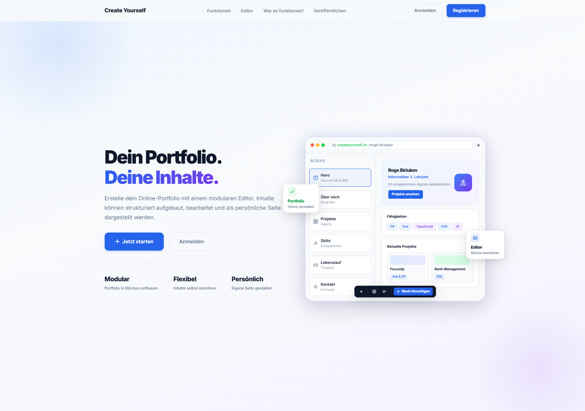
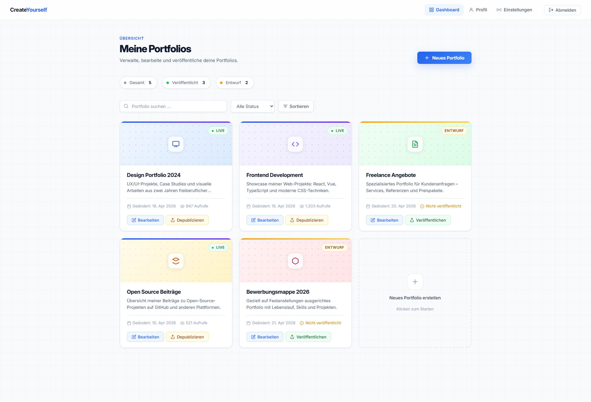

# IPT7.1-Projekt-Kick-Off

**Autoren:** Gian, Egor, Sanjivan, Kenan

## Vorschau

**Landingpage:**

**Dashboard:**

## Projektbeschreibung

CreateYourself ist eine Webanwendung, mit der Nutzer einfach und schnell ein eigenes Portfolio erstellen können. Die Plattform ermöglicht es, Projekte, Fähigkeiten, Erfahrungen und Kontaktdaten übersichtlich darzustellen. Nutzer können ihr Portfolio individuell gestalten und online veröffentlichen, um ihre Arbeit anderen zu präsentieren.

## Features

- Portfolio selber erstellen mit Baukasten-Elementen
- Benutzer Registration und Anmeldung mit Benutzername, E-Mail und Passwort.
- Benutzeroberfläche in mehreren Sprachen verfügbar. Diese Sprache kann man auch zu jeder Zeit anpassen.
- Die auswählbaren Layouts sollen dem Benutzer helfen mit Leichtigkeit ein Professionell oder kreativ aussehendes Portfolio zu erstellen.
- Portfolio erhält eine dauerhafte, eindeutige URL (Hash-basiert). Womit der Benutzer sein Portfolio teilen kann.

## Inhalt und Umfang

-	Account und Login
-	Portfolio erstellen
-	Baukasten-Editor
-	Design Grundlagen (Theme auswählen + Farben und Font)
-	Veröffentlichen
-	Speichern / Versionstand
-	Portfolio verwalten
-	Security / Grundschutz
-	Mehrsprachigkeit
-   Drag and Drop im Editor

## Rollen

**Sanjivan:** Teamleiter, Frontend Specialist: Erledigt fast alle Frontend-Aufgaben und geht jede Änderung durch.
**Gian:** Backend-Specialist: Erstellt und dokumentiert das ganze Backend.
**Egor:** Database-Specialist: Erstellt die ganze Datenbank und die dazugehörigen Diagramme. Hilft beim Frontend.
**Kenan:** Dokumentator: Erstellt die meisten grundlegenen Dokumente und übernimmt die Übersetzung bei der Mehrsprachigkeit.

