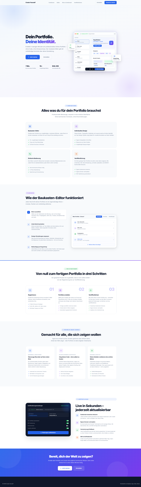
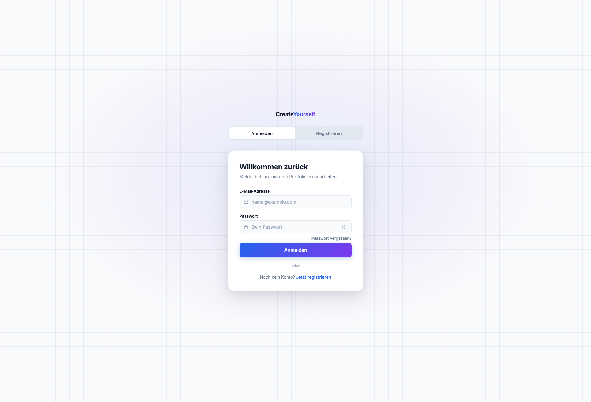
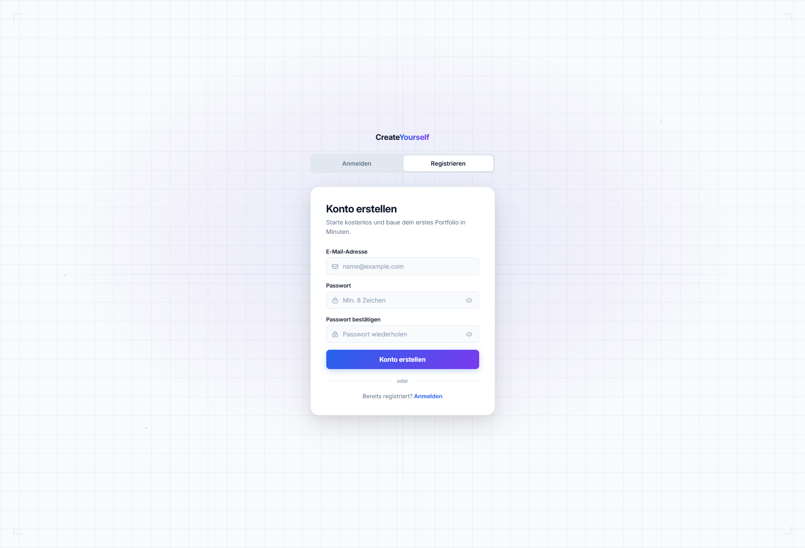

# IPT7.1-Projekt-Kick-Off

**Autoren:** Gian, Egor, Sanjivan, Kenan

## Vorschau

**Landingpage:**

**Dashboard:**

**Login:**

**Register:**

## Projektbeschreibung

CreateYourself ist eine Webanwendung, mit der Nutzer einfach und schnell ein eigenes Portfolio erstellen können. Die Plattform ermöglicht es, Projekte, Fähigkeiten, Erfahrungen und Kontaktdaten übersichtlich darzustellen. Nutzer können ihr Portfolio individuell gestalten und online veröffentlichen, um ihre Arbeit anderen zu präsentieren.

## Features

- Portfolio selber erstellen mit Baukasten-Elementen
- Benutzer Registration und Anmeldung mit Benutzername, E-Mail und Passwort.
- Benutzeroberfläche in mehreren Sprachen verfügbar. Diese Sprache kann man auch zu jeder Zeit anpassen.
- Die auswählbaren Layouts sollen dem Benutzer helfen mit Leichtigkeit ein Professionell oder kreativ aussehendes Portfolio zu erstellen.
- Portfolio erhält eine dauerhafte, eindeutige URL (Hash-basiert). Womit der Benutzer sein Portfolio teilen kann.

## User Stories

1. Als Nutzer will ich ein Konto erstellen können, damit ich mein Portfolio speichern und später bearbeiten kann.
2.	Als Nutzer möchte ich mich einloggen können, damit ich auf mein Portfolio zugreifen kann.
3.	Als Nutzer möchte ich ein neues Portfolio erstellen können, damit meine Projekte und Fähigkeiten präsentieren kann.
4.	Als Nutzer möchte ich Projekte zu meinem Portfolio hinzufügen können, damit Besucher meine Arbeiten sehen können.
5.	Als Nutzer möchte ich Texte, Bilder und Links hinzufügen können, damit ich mein Portfolio individuell gestalten kann.
6.	Als Nutzer möchte ich das Design meines Portfolios anpassen können, damit es meinem persönlichen Stil entspricht.
7.	Als Nutzer möchte ich eine Vorschau meines Portfolios sehen können, damit ich überprüfen kann, wie es für Besucher aussieht.
8.	Als Nutzer will ich mein Portfolio veröffentlichen können, damit andere Personen es online ansehen können.
9.	Als Besucher möchte ich ein Portfolio einfach ansehen können, damit ich schnell Informationen über die Person und ihre Projekte finde.
10.	Als Nutzer möchte ich mein Portfolio jederzeit bearbeiten oder aktualisieren können, damit meine Inhalte aktuell bleiben.

